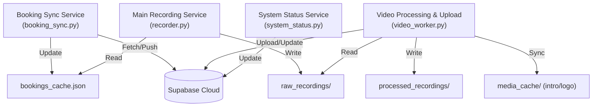
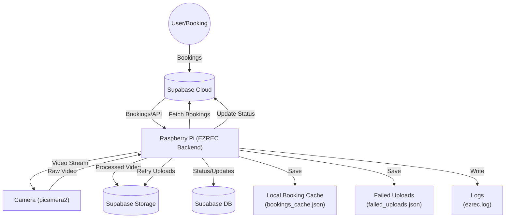
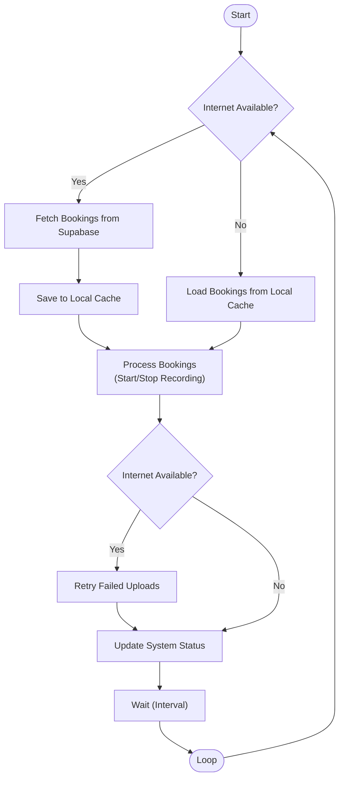

# EZREC Backend - Automated Video Recording System

EZREC Backend is a robust, modular backend system for automated video recording, processing, and upload, designed for Raspberry Pi and similar devices. It is built to be resilient to internet outages, scalable, and easy to maintain.

## 🚀 Overview
- **Automates video recording based on bookings from Supabase**
- **Processes videos with optional intro and logo overlays**
- **Uploads videos to Supabase Storage and updates the database**
- **Tracks and reports system health/status**
- **Fully modular: each core function runs as a separate service/process**

## 🏗️ Architecture

The backend is split into four independent microservices, each running as a separate process (or systemd service):

1. **Booking Sync Service (`booking_sync.py`)**
   - Fetches bookings from Supabase and keeps a local cache up to date.
2. **Main Recording Service (`recorder.py`)**
   - Reads bookings from the local cache and records video at scheduled times.
3. **Video Processing & Upload Service (`video_worker.py`)**
   - Processes raw recordings, adds intro/logo, uploads to Supabase, and manages upload retries.
4. **System Status Service (`system_status.py`)**
   - Collects and uploads system health metrics to Supabase.

### System Diagram



## ⚡ Quickstart
1. **Clone the repo and install dependencies**
2. **Configure your `.env` file** with Supabase credentials and paths
3. **Run each service as a separate process or systemd service**
4. **See [documentation.md](./documentation.md) for detailed service/algorithm explanations**

---

For detailed algorithms, service internals, and troubleshooting, see [documentation.md](./documentation.md).

## 🎯 Features

- **Automated Recording**: Detects bookings from Supabase and starts/stops recording automatically
- **Video Processing**: Stitches intro videos and overlays logos using FFmpeg
- **Cloud Upload**: Uploads processed videos to Supabase storage
- **System Monitoring**: Real-time monitoring of Pi performance and camera status
- **Booking Management**: Polls for active bookings every 3 seconds
- **Reliable Upload**: Retry mechanism with exponential backoff
- **systemd Integration**: Runs as a system service with auto-restart

## 🛠 Tech Stack

| Component          | Technology    | Purpose                              |
| ------------------ | ------------- | ------------------------------------ |
| Camera Interface   | **picamera2** | Native Raspberry Pi camera support   |
| Video Processing   | **FFmpeg**    | Video concatenation and logo overlay |
| Database/Storage   | **Supabase**  | PostgreSQL database and file storage |
| Service Management | **systemd**   | Background service with auto-restart |
| Language           | **Python 3**  | Main application logic               |

## 📋 Requirements

### Hardware

- Raspberry Pi 4 (recommended) or newer
- Raspberry Pi Camera Module (wired connection)
- MicroSD card (32GB+ recommended)
- Stable internet connection

### Software

- Raspberry Pi OS (Debian-based)
- Python 3.7+
- FFmpeg
- picamera2 library

## 🚀 Quick Installation

### On Raspberry Pi:

1. **Clone the repository:**

   ```bash
   git clone https://github.com/naeimsalib/EZREC-BACKEND-2.git
   cd EZREC-BACKEND-2
   ```

2. **Run the deployment script:**

   ```bash
   chmod +x deployment.sh
   ./deployment.sh
   ```

3. **Configure environment variables:**

   ```bash
   nano /opt/ezrec-backend/.env
   ```

   Update with your credentials:

   ```env
   SUPABASE_URL=https://iszmsaayxpdrovealrrp.supabase.co
   SUPABASE_KEY=your_supabase_anon_key_here
   CAMERA_ID=your_camera_id_from_database
   RECORDING_FPS=30
   LOG_LEVEL=INFO
   ```

4. **Start the service:**
   ```bash
   sudo systemctl start ezrec-backend
   sudo systemctl status ezrec-backend
   ```

## 📁 Project Structure

```
EZREC-BACKEND-2/
├── ezrec_backend.py       # Main backend application
├── main.py                # Simple service runner
├── requirements.txt       # Python dependencies
├── env.example           # Environment template
├── ezrec-backend.service # systemd service file
├── deployment.sh         # Raspberry Pi deployment script
└── README.md             # This file
```

## 🔧 Configuration

### Environment Variables

| Variable        | Description               | Example                   |
| --------------- | ------------------------- | ------------------------- |
| `SUPABASE_URL`  | Your Supabase project URL | `https://xyz.supabase.co` |
| `SUPABASE_KEY`  | Supabase anonymous key    | `eyJhbGc...`              |
| `CAMERA_ID`     | Camera ID from database   | `0` or UUID               |
| `RECORDING_FPS` | Video frame rate          | `30`                      |
| `LOG_LEVEL`     | Logging level             | `INFO`, `DEBUG`, `ERROR`  |

### Database Schema

The system uses these Supabase tables:

- **`cameras`**: Camera configuration and status
- **`bookings`**: Recording schedules
- **`videos`**: Uploaded video metadata
- **`system_status`**: Pi performance metrics
- **`user_settings`**: User's intro video and logo paths

### File Naming Convention

Videos are automatically named using this format:

```
recording_YYYYMMDD_HHMMSS_uuid.mp4
```

Example: `recording_20250619_200206_19536f23-bf9e-4642-b8fd-5916adc2eaac.mp4`

## 🎬 Recording Workflow

1. **Booking Detection**: Polls database every 3 seconds for active bookings
2. **Recording Start**: Begins recording when booking is active
3. **Recording Stop**: Stops when booking ends
4. **Post-Processing**:
   - Downloads intro video (if available)
   - Downloads logo (if available)
   - Concatenates intro + main recording
   - Overlays logo in bottom-right corner
5. **Upload**: Uploads final video to Supabase storage
6. **Database Update**: Inserts video metadata
7. **Cleanup**: Removes local files after successful upload

## 🔄 Service Management

### systemd Commands

```bash
# Start service
sudo systemctl start ezrec-backend

# Stop service
sudo systemctl stop ezrec-backend

# Restart service
sudo systemctl restart ezrec-backend

# Check status
sudo systemctl status ezrec-backend

# Enable auto-start on boot
sudo systemctl enable ezrec-backend

# Disable auto-start
sudo systemctl disable ezrec-backend

# View real-time logs
sudo journalctl -u ezrec-backend -f

# View logs from last boot
sudo journalctl -u ezrec-backend -b

# Check warnings or erros 
sudo journalctl -u ezrec-backend.service | grep -i 'error\|warning'
```

### Log Files

- **Service logs**: `sudo journalctl -u ezrec-backend -f`
- **Application logs**: `/opt/ezrec-backend/logs/ezrec.log`

## 📜 Logging Commands

### View Live Service Logs (systemd)
```bash
sudo journalctl -u ezrec-backend.service -f
```
- Shows real-time logs from the systemd service. Press Ctrl+C to stop.

### View Last 50 Lines and Follow
```bash
sudo journalctl -u ezrec-backend.service -n 50 -f
```
- Shows the last 50 lines, then continues to show new logs as they appear.

### Filter for Errors and Warnings
```bash
sudo journalctl -u ezrec-backend.service | grep -i 'error\|warning'
```
- Shows only lines containing 'error' or 'warning'.

### View Application Log File Directly
```bash
tail -f /opt/ezrec-backend/logs/ezrec.log
```
- Shows the backend's own log file in real time.

## 🐛 Troubleshooting

### Common Issues

**Camera not detected:**

```bash
# Check camera connection
libcamera-hello --list-cameras

# Check camera permissions
ls -la /dev/video*

# Add user to video group
sudo usermod -a -G video pi
```

**Service won't start:**

```bash
# Check service status
sudo systemctl status ezrec-backend

# Check logs for errors
sudo journalctl -u ezrec-backend -n 50

# Test Python dependencies
cd /opt/ezrec-backend
source venv/bin/activate
python3 -c "from picamera2 import Picamera2; print('Camera OK')"
```

**Upload failures:**

```bash
# Check internet connection
ping supabase.co

# Verify Supabase credentials
# Check .env file for correct URL and key

# Check disk space
df -h /opt/ezrec-backend/temp
```

### Camera Configuration

For Raspberry Pi camera, ensure these lines are in `/boot/config.txt`:

```
camera_auto_detect=1
dtoverlay=vc4-kms-v3d
```

Reboot after making changes:

```bash
sudo reboot
```

## 📊 Monitoring

The system automatically monitors and reports:

- **CPU usage and temperature**
- **Memory and disk usage**
- **Network connectivity**
- **Recording status**
- **Upload success/failure**
- **Camera health**

All metrics are stored in the `system_status` table and updated every 3 seconds.

## 🔒 Security

The systemd service includes security hardening:

- Runs as non-root user (`pi`)
- Private temporary directories
- Read-only system protection
- No new privileges allowed

## 🤝 Contributing

1. Fork the repository
2. Create a feature branch
3. Make your changes
4. Test on Raspberry Pi
5. Submit a pull request

## 📝 License

This project is licensed under the MIT License.

## 🆘 Support

For issues and questions:

1. Check the troubleshooting section above
2. Review the service logs
3. Open an issue on GitHub

## 🚦 Offline/Resilience Features

### Local Booking Cache
- The backend fetches bookings from Supabase and saves them to a local cache file.
- If the device loses internet, it continues to process and record based on the last known bookings.
- Recordings will start and stop at the correct times even if the Pi is offline, as long as bookings were fetched before the outage.

### Deferred Uploads & Retry
- If a video upload fails due to internet loss, the backend saves the upload info to a local file.
- The device will keep operating normally and will retry all failed uploads automatically when internet connectivity is restored.
- Successfully uploaded videos are removed from the retry queue.

### Summary
- The device is robust against temporary internet outages: it will not miss scheduled recordings and will eventually upload all videos once the connection is back.

## 🗺️ Architecture & Flow Diagrams

### System Architecture



### Main Loop & Offline Resilience Flow



---

**Made with ❤️ for automated video recording on Raspberry Pi**
